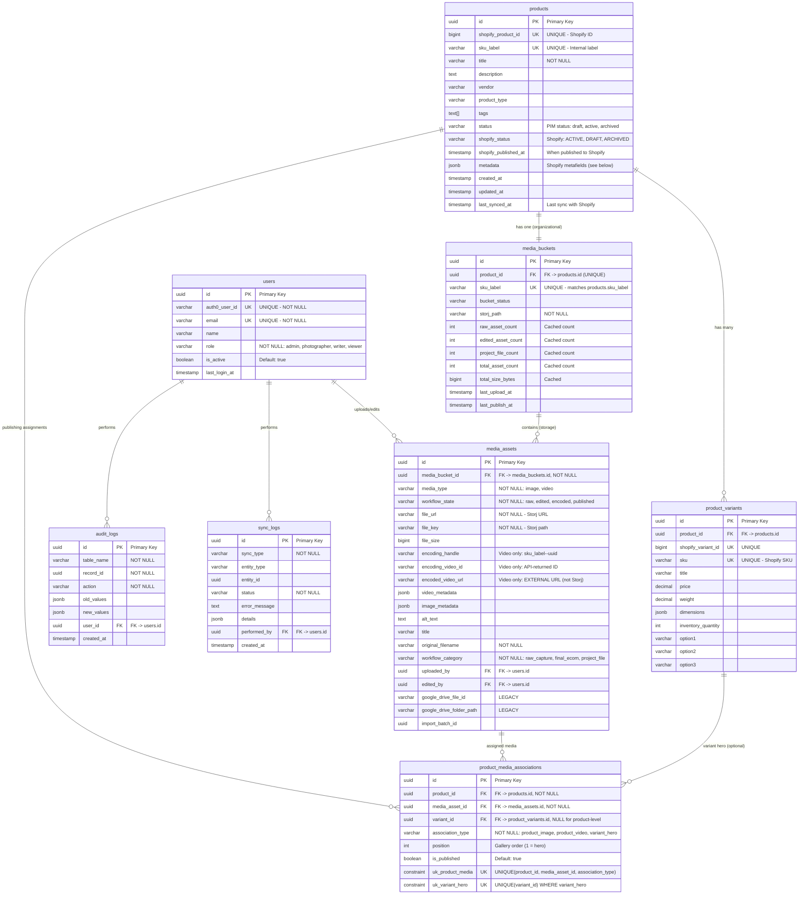

# Database Schema - Entity Relationship Diagram

## Core Entity Relationships



### Constraint Legend
| Symbol | Meaning |
|--------|---------|
| **PK** | Primary Key |
| **UK** | Unique constraint |
| **FK** | Foreign Key |
| **(UNIQUE)** in comment | Foreign Key that is also Unique (one-to-one relationship) |

### Product Metafields (Shopify Custom Fields)

The following **product-level metafields** are used in Shopify and stored in `products.metadata` (JSONB):

| Metafield | Description |
|-----------|-------------|
| `KS ID Product Group` | Internal product grouping identifier |
| `KS ID Product Type` | Internal product type identifier |
| `KS Collection ID Number` | Collection identifier |
| `Key Features` | Product feature highlights |
| `Key Benefits` | Product benefit highlights |
| `Custom Message` | Custom product messaging |
| `Review` | Product review content |

**Note**: Variant metafields are not currently used.

## Key Relationships Explained

### 1. Product ↔ Variants (One-to-Many)
- One product has many variants
- Variants have actual Shopify SKUs (e.g., `RSV-V-PRODUCTXYZ-S`, `RSV-V-PRODUCTXYZ-M`)
- Products have internal `sku_label` (e.g., `RSV-V-PRODUCTXYZ`) - NOT a Shopify SKU

### 2. Product ↔ Media Bucket (One-to-One)
- Every product has exactly ONE media bucket
- Bucket identified by `sku_label` matching `products.sku_label`
- Bucket contains cached statistics (raw count, edited count, etc.)
- Physical storage at `products/{sku_label}/` in Storj

### 3. Media Bucket ↔ Media Assets (One-to-Many)
- **Each asset is STORED in exactly ONE bucket** via `media_assets.media_bucket_id` (NOT NULL FK)
- Direct foreign key relationship (no junction table needed for storage location)
- Enforces clear storage ownership: one asset file = one bucket location
- Query pattern: `SELECT * FROM media_assets WHERE media_bucket_id = ?`
- **NOTE**: An asset can be ASSIGNED to multiple products via `product_media_associations` (no file duplication needed)

### 4. Product Media Associations (Publishing Source of Truth)
- **`product_media_associations` is the SOLE source of truth for what gets published to Shopify**
- Media bucket membership (via `media_assets.media_bucket_id`) is purely organizational
- Just because an image is in a product's bucket does NOT mean it gets published
- This table explicitly defines:
  - Which images are assigned to a product
  - The order of images in the product gallery
  - Which image is the hero (position = 1 for product-level)
  - Which videos are associated with a product
  - Variant-specific hero images (when `variant_id` is set)
- **UI Behavior**: Images from the SKU bucket matching the product are highlighted/suggested for publication, but users can choose any image from any bucket.
- **Future flexibility**: Buckets may exist without products (example unique label "LEATHER SHOTS"); publishing points may later expand beyond products

### 5. Media Workflow States
```
Images:  raw → edited → ready_for_publish → published
Videos:  raw → edited → encoding_submitted → encoded → ready_for_publish → published
```

### 6. Media Categories (workflow_category)
- `raw_capture`: Original photographer uploads
- `final_ecom`: Edited, ready for ecommerce
- `project_file`: PSDs, project files
- `psd_cutout`: Photoshop cutouts

## Product Status & Publishing Workflow

### Two Status Fields

Products have **two separate status fields** to track PIM state vs Shopify state:

| Field | Source | Values | Purpose |
|-------|--------|--------|---------|
| `status` | PIM (internal) | `draft`, `active`, `archived` | Internal workflow state |
| `shopify_status` | Shopify (synced) | `ACTIVE`, `DRAFT`, `ARCHIVED` | Current state in Shopify |

### Status Definitions

**PIM Status (`status`):**
| Value | Meaning |
|-------|---------|
| `draft` | Work in progress - not ready for Shopify |
| `active` | Ready/published - actively managed |
| `archived` | No longer active - hidden from default views |

**Shopify Status (`shopify_status`):**
| Value | Meaning |
|-------|---------|
| `ACTIVE` | Published and visible on storefront |
| `DRAFT` | Exists in Shopify but not visible |
| `ARCHIVED` | Hidden from storefront and admin by default |

### Publishing Workflow


### Common Scenarios

| Scenario | `status` | `shopify_status` | Description |
|----------|----------|------------------|-------------|
| New product being set up | `draft` | `NULL` | Not yet sent to Shopify |
| Ready but not published | `active` | `NULL` | Ready in PIM, not in Shopify yet |
| Published as draft | `active` | `DRAFT` | In Shopify but hidden |
| Live on storefront | `active` | `ACTIVE` | Fully published and visible |
| Discontinued | `archived` | `ARCHIVED` | No longer sold |
| Seasonal (hidden) | `active` | `DRAFT` | Temporarily hidden |

### Filtering Products by Status

```sql
-- Products ready to publish (in PIM but not in Shopify)
SELECT * FROM products 
WHERE status = 'active' AND shopify_status IS NULL;

-- Products live on storefront
SELECT * FROM products 
WHERE shopify_status = 'ACTIVE';

-- Products in staging (in Shopify as draft)
SELECT * FROM products 
WHERE shopify_status = 'DRAFT';

-- All active products in PIM (regardless of Shopify state)
SELECT * FROM products 
WHERE status = 'active';

-- Products needing attention (PIM archived but still live in Shopify)
SELECT * FROM products 
WHERE status = 'archived' AND shopify_status = 'ACTIVE';
```

### Sync Behavior

| Action | Effect on `status` | Effect on `shopify_status` |
|--------|-------------------|---------------------------|
| Import from Shopify | Set to `active` | Synced from Shopify |
| Edit in PIM | No change | No change (until sync) |
| Publish to Shopify | No change | Updated after sync |
| Archive in PIM | Set to `archived` | No change (manual sync needed) |
| Change in Shopify | No change | Updated on next import/sync |

**Conflict Resolution**: If a product is edited in both PIM and Shopify:
- PIM is source of truth for media assignments
- Shopify is source of truth for inventory/pricing
- Metadata conflicts: PIM wins on publish, Shopify wins on import (configurable)

## SKU Architecture

### Critical Constraint: No Collisions
```sql
-- products.sku_label must NOT match any product_variants.sku
-- Enforced by database triggers
```

### Examples

#### Multi-Variant Product
```
Product sku_label: "RSV-V-PRODUCTXYZ"        ← Internal label (NOT in Shopify)
Variant SKUs:      "RSV-V-PRODUCTXYZ-S"      ← Real Shopify SKU
                   "RSV-V-PRODUCTXYZ-M"      ← Real Shopify SKU
                   "RSV-V-PRODUCTXYZ-L"      ← Real Shopify SKU

Media Bucket:      products/RSV-V-PRODUCTXYZ/  (Storj - permanent storage)
Google Drive:      RSV-V-PRODUCTXYZ/           (LEGACY - import source only)
```

#### Single-Variant Product
```
Product sku_label: "UNIQUE-SKU-123"          ← Internal label
Variant SKU:       "UNIQUE-SKU-123"          ← Real Shopify SKU (MUST match sku_label)

Media Bucket:      products/UNIQUE-SKU-123/    (Storj - permanent storage)
Google Drive:      UNIQUE-SKU-123/             (LEGACY - import source only)
```
**Note**: For single-variant products, the variant SKU and product sku_label MUST be identical. This is how the system matches the media bucket to suggest which assets to publish.

## Query Patterns

### Bucket Queries (Organizational - What's in Storage)
```typescript
// Get bucket by SKU label
const bucket = await MediaBucket.findBySkuLabel('RSV-V-PRODUCTXYZ');

// Get all assets in the bucket (for browsing/selection UI)
const allAssets = await bucket.getAllAssets();

// Get raw sources, edited, project files
const raw = await bucket.getRawSources();
const edited = await bucket.getEditedAssets();
const projects = await bucket.getProjectFiles();

// Cached statistics (fast, no asset query needed)
console.log(bucket.rawAssetCount);       // 10
console.log(bucket.editedAssetCount);    // 7
console.log(bucket.totalAssetCount);     // 22
```

### Publishing Queries (What Gets Published to Shopify)
```typescript
// Get images assigned to a product (ordered by position)
const assignedImages = await ProductMediaAssociation.getProductImages(productId);
// → Returns images in gallery order, position 1 = hero

// Get hero image for product (position 1, variant_id NULL)
const productHero = await ProductMediaAssociation.getProductHero(productId);

// Get hero image for a specific variant
const variantHero = await ProductMediaAssociation.getVariantHero(variantId);

// Get all videos assigned to a product
const videos = await ProductMediaAssociation.getProductVideos(productId);

// Assign an image to a product
await ProductMediaAssociation.assignImage(productId, mediaAssetId, position);

// Set variant hero (uses image already assigned to product)
await ProductMediaAssociation.setVariantHero(variantId, mediaAssetId);
```

### Key Distinction
```typescript
// Bucket: "What images exist in storage for this SKU?"
const bucket = await MediaBucket.findBySkuLabel('RSV-V-PRODUCTXYZ');
const available = await bucket.getAllAssets();  // 15 images in bucket

// Associations: "Which images are assigned to this product?"
const assigned = await ProductMediaAssociation.getProductImages(productId);  // 5 images assigned
// These 5 are what get published to Shopify
```

## Storj Storage Structure

```
storj://kinkstore-pim/
└── products/
    └── RSV-V-PRODUCTXYZ/               ← Bucket root (sku_label)
        ├── photos/
        │   ├── raw/                    ← workflow_state: raw
        │   │   ├── DSC09935.JPG
        │   │   └── DSC09937.JPG
        │   ├── edited/                 ← workflow_state: edited/ready_for_publish
        │   │   ├── product-1.jpg
        │   │   └── product-2.jpg
        │   └── project/                ← workflow_category: project_file
        │       └── product-1.psd
        └── videos/
            ├── raw/                    ← workflow_state: raw (source files)
            ├── edited/                 ← workflow_state: edited (trimmed/stitched, pre-encoding)
            └── project/                ← workflow_category: project_file
```

**Note on Encoded Videos:**
- Encoded videos are **NOT stored in Storj**
- They are hosted by the external encoding service
- We store only the **URL** in `media_assets.encoded_video_url`
- The URL points to the encoding service's CDN

## Import Flow

**Google Drive is for ONE-TIME IMPORT ONLY:**
- Google Drive folders are the **source** for initial media migration
- Files are copied to Storj (permanent storage) during import
- Google Drive file/folder IDs are stored as **legacy reference** only
- After import, Google Drive is NOT used for ongoing operations
- All future media management happens in PIM → Storj → Shopify


## Publish to Shopify Flow


### Publishing Logic Summary
1. **Product images come from `product_media_associations`** (NOT from bucket directly)
2. **Position 1 = product hero image** (also used as variant[0] hero if single variant)
3. **Variant heroes are explicit associations** where `variant_id IS NOT NULL`
4. **Bucket is just storage** - images must be explicitly assigned to be published

## Video Encoding API Integration

**Endpoint**: `https://server.kinkstorage.com/graphql`
**Authentication**: API Key (Bearer token)

### Naming Convention (internalName)

Videos are identified by an `internalName` handle that we generate:

```
{sku_label}--{media_asset_uuid}
```

**Example**: `RSV-V-PRODUCTXYZ--550e8400-e29b-41d4-a716-446655440000`

| Component | Purpose |
|-----------|---------|
| `sku_label` | Searchable by product via `videos(searchTerm: "RSV-V-PRODUCTXYZ")` |
| `--` | Clean separator (SKUs may contain single dashes) |
| `media_asset_uuid` | Direct link to `media_assets` record, guaranteed unique |

### API Mutations

| Mutation | Args | Returns | Description |
|----------|------|---------|-------------|
| `startVideoUpload` | `content: String!`, `internalName: String` | `{ id, url }` | Get upload URL |
| `finishVideoUpload` | `videoId: String!` | - | Trigger encoding |
| `promoteAssets` | `imageAssetIds: [ID]!`, `videoAssetIds: [ID]!` | - | Promote to active |
| `softDeleteVideo` | `videoId: ID!` | - | Soft delete |

### API Queries

| Query | Args | Returns | Description |
|-------|------|---------|-------------|
| `video` | `videoId: String!` | `TranscodedVideo` | Get by ID (fast) |
| `videos` | `take, skip, searchTerm` | `[TranscodedVideo]` | Search/list videos |

### Response Types

```graphql
type TranscodedVideo {
  id: ID!
  internalName: String       # Our tracking handle
  owner: String!
  status: FileUploadingStatus!  # Uploaded | NotUploaded
  videoAssets: [VideoAsset]  # Encoded outputs
  imageAssets: [ImageAsset]  # Generated thumbnails
}

type VideoAsset {
  id: ID!
  url: URL!        # Final encoded video URL
  format: String!  # mp4, webm, etc.
  type: String!    # hls, dash, etc.
  status: String!
}

type ImageAsset {
  id: ID!
  url: URL!
  resolution: String!  # e.g., "1920x1080"
  tag: String!
}
```

### Video Encoding Workflow


### Fields Stored in media_assets

| Field | Value | Purpose |
|-------|-------|---------|
| `encoding_handle` | `{sku_label}--{uuid}` | Our internalName for searching |
| `encoding_video_id` | API-returned ID | Direct lookup via `video(videoId)` |
| `encoded_video_url` | `videoAssets[0].url` | Final playable URL |
| `workflow_state` | `encoding_submitted` → `encoded` | Track progress |

