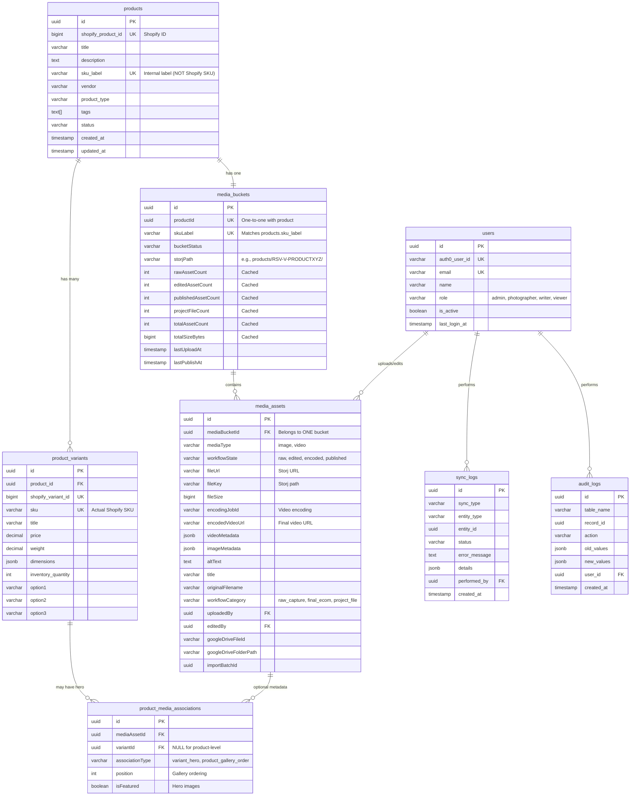

# Database Schema - Entity Relationship Diagram

## Core Entity Relationships



## Key Relationships Explained

### 1. Product ↔ Variants (One-to-Many)
- One product has many variants
- Variants have actual Shopify SKUs (e.g., `RSV-V-PRODUCTXYZ-S`, `RSV-V-PRODUCTXYZ-M`)
- Products have internal `sku_label` (e.g., `RSV-V-PRODUCTXYZ`) - NOT a Shopify SKU

### 2. Product ↔ Media Bucket (One-to-One)
- Every product has exactly ONE media bucket
- Bucket identified by `sku_label` matching `products.sku_label`
- Bucket contains cached statistics (raw count, edited count, etc.)
- Physical storage at `products/{sku_label}/` in Storj

### 3. Media Bucket ↔ Media Assets (One-to-Many) **[KEY CHANGE]**
- **Each asset belongs to exactly ONE bucket** via `media_assets.media_bucket_id` (NOT NULL FK)
- Direct foreign key relationship (no junction table needed for basic membership)
- Enforces clear ownership: one asset = one product bucket
- Query pattern: `SELECT * FROM media_assets WHERE media_bucket_id = ?`
- If same image needed for multiple products, must copy the file (explicit duplication)

### 4. Variant Hero Images (Optional Metadata via product_media_associations)
- `product_media_associations` table stores ONLY optional metadata
- Used for: variant hero images and gallery ordering
- `variant_id` is NULL for product-level associations
- `variant_id` is set for variant-specific hero images
- Each variant can have ONE hero image selected from the bucket's media pool
- `is_featured = TRUE` marks hero images
- **Note**: This table does NOT establish bucket membership (that's via media_assets.media_bucket_id)

### 5. Media Workflow States
```
Images:  raw → edited → ready_for_publish → published
Videos:  raw → edited → encoding_submitted → encoded → ready_for_publish → published
```

### 6. Media Categories (workflow_category)
- `raw_capture`: Original photographer uploads
- `final_ecom`: Edited, ready for ecommerce
- `project_file`: PSDs, project files
- `psd_cutout`: Photoshop cutouts

## SKU Architecture

### Critical Constraint: No Collisions
```sql
-- products.sku_label must NOT match any product_variants.sku
-- Enforced by database triggers
```

### Examples

#### Multi-Variant Product
```
Product sku_label: "RSV-V-PRODUCTXYZ"        ← Internal label (NOT in Shopify)
Variant SKUs:      "RSV-V-PRODUCTXYZ-S"      ← Real Shopify SKU
                   "RSV-V-PRODUCTXYZ-M"      ← Real Shopify SKU
                   "RSV-V-PRODUCTXYZ-L"      ← Real Shopify SKU

Media Bucket:      products/RSV-V-PRODUCTXYZ/
Google Drive:      RSV-V-PRODUCTXYZ/
```

#### Single-Variant Product
```
Product sku_label: "UNIQUE-SKU-123"          ← Internal label
Variant SKU:       "UNIQUE-SKU-123"          ← Real Shopify SKU (same is OK)

Media Bucket:      products/UNIQUE-SKU-123/
Google Drive:      UNIQUE-SKU-123/
```

## Query Patterns via MediaBucket Class

### Get Media by Type
```typescript
// Get published assets for product
const bucket = await MediaBucket.findBySkuLabel('RSV-V-PRODUCTXYZ');
const published = await bucket.getPublishedAssets();

// Get raw sources
const raw = await bucket.getRawSources();

// Get edited (ready for publish)
const edited = await bucket.getEditedAssets();

// Get project files (PSDs, etc.)
const projects = await bucket.getProjectFiles();
```

### Variant Hero Images
```typescript
// Set variant hero image
await bucket.setVariantHeroImage(variantId, imageAssetId);

// Get hero for specific variant
const hero = await bucket.getVariantHeroImage(variantId);
```

### Cached Statistics
```typescript
// Fast access without querying assets
console.log(bucket.rawAssetCount);       // 10
console.log(bucket.editedAssetCount);    // 7
console.log(bucket.publishedAssetCount); // 5
console.log(bucket.totalAssetCount);     // 22
```

## Storj Storage Structure

```
storj://kinkstore-pim/
└── products/
    └── RSV-V-PRODUCTXYZ/               ← Bucket root (sku_label)
        ├── photos/
        │   ├── raw/                    ← workflow_state: raw
        │   │   ├── DSC09935.JPG
        │   │   └── DSC09937.JPG
        │   ├── edited/                 ← workflow_state: edited/ready_for_publish
        │   │   ├── product-1.jpg
        │   │   └── product-2.jpg
        │   └── project/                ← workflow_category: project_file
        │       └── product-1.psd
        └── videos/
            ├── raw/                    ← workflow_state: raw
            ├── edited/                 ← workflow_state: edited
            ├── encoded/                ← workflow_state: encoded (from API)
            └── project/                ← project files
```

## Import Flow


## Publish to Shopify Flow


